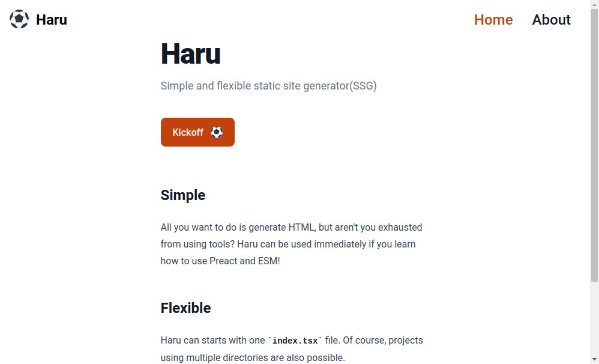

# 自作SSGを作っている話

こまもか

---

# お前、誰よ

Name: こまもか
Twitter(X): @Comamoca_
GitHub: https://github.com/comamoca
好きな言語: Lisp(書けるとは言ってない)

Gleamの入門本書こうと思って未だに手を付けられてない(冬コミに間に合わせたい...)

---

# 自作SSGを作っている

https://github.com/comamoca/haru

---

# なぜ自作SSGなのか

自分がSSGを使うケースが専らMarkdown to HTMLだった

- ただMarkdown to HTMLするだけなのにSSGのお作法を調べるのがつらい
- 自分でMarkdown to HTMLするスクリプト書いたほうが早い
- かと言って毎回書くのも面倒

自作しよう！

---

# 使用している技術

- Deno
- Preact(前はNanoJSX)
- Hono(ライブリロード/プレビュー)

---

# Deno

- JS/TS書くときは大体これを使っている
- TS + Rustの開発体験
- ライブラリの導入コストが無視できるレベルで小さい

---

# Preact

- Fresh(Deno公式のWebフレームワーク)で採用されていて安定性が期待できる
- Reactとある程度の互換性がある(期待はしていない)

---

# Hono 

- どこでも動く
- ミドルウェアが豊富で実装が楽
- 最近WebSocketが追加された(うれしい)

---

# どのような仕組みで動いているのか

- 指定されたディレクトリ内のindex.{tsx, jsx}をglob
- default exportされている関数を実行し、JSXをHTMLに変換
- Pathを操作して書き込み先に変換(ファイルベースルーティング) - 書き込み
めちゃくちゃシンプル

---

# シンプルゆえの拡張性

- 実体はただの{tsx, jsx}ファイル
- JS/TSのエコシステムを有効に活用出来る(なんでも出来る)
  例えば...
  - Tailwindの使用(公式でユーティリティを実装済み)
  - Pagefindを使った全文検索(公式でユーティリティを提供予定)
  - exbuild/deno_emitを使ってクライアントサイドでフレームワークを展開
  - DOMを使ってレンダリングされたHTMLを操作

---

# これから

- ブログと備忘録サイトをHaruにリプレース
- 公式のユーティリティを拡充
- リファクタリング
