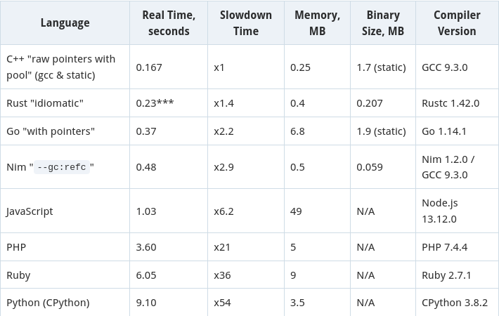

## Nim でエレガントなコードを書こう

発表者: こまもか

---

## Nim とは?

---

2008 年から開発されているシステムプログラミング言語
C、C++、Ada などの反省を活かして作られた
言語レベルでメタプログラミングがサポートされているため、柔軟にプログラムが書ける

---

## Nim のここがすごい

速い。とにかく速い。Rust/Go と同レベル
バイナリサイズが小さい。
Python のような文法でサクッと書ける

参照: Nimを知ってほしい2022 
https://zenn.dev/dumblepy/articles/b475b3b4f7d0da

---

## なんで Nim は速いの？

Nim コンパイラはバイナリではなく、最適化された C プログラムを出力する
更に C コンパイラで更に最適化されるため速く実行できる

---

## 使われている分野

Web
サーバー、フロントエンド
Js にも変換出来る！

CLI

TUI ライブラリ illwill(日本語未対応)
cligen(CUI ツール作成ライブラリ)

---

マルチメディア

blackvas(Vue like なキャンバスライブラリ)

他言語連携

Nimpy(Nim&Python)

---

## 開発に役立つツール

choosenim
Nim の環境構築ツール

nimlsp
Nim の Language Server

nimble
Nim のパッケージマネージャ兼ビルドツール

---
