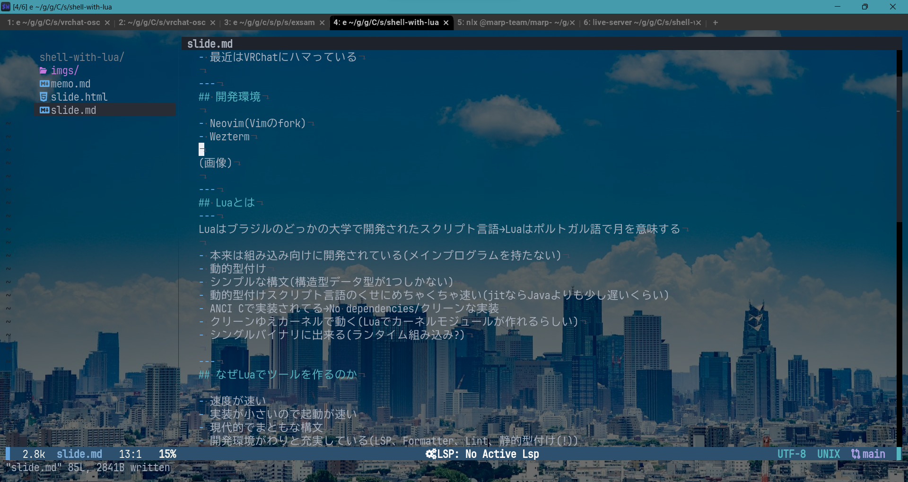
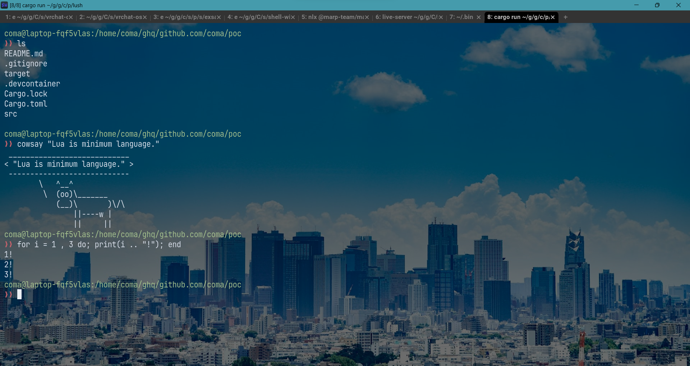

## Luaが動くシェルを作っている話
---
## 自己紹介

- 専らCLI系のツールを書いてる
- 最近はVRChatにハマっている

---
## 開発環境

- Neovim(Vimのfork)
- Wezterm



---
## Luaとは
---
Luaはブラジルのどっかの大学で開発されたスクリプト言語→Luaはポルトガル語で月を意味する

- 本来は組み込み向けに開発されている(メインプログラムを持たない)
- 動的型付け
- シンプルな構文(構造型データ型が1つしかない)
- 動的型付けスクリプト言語のくせにめちゃくちゃ速い(jitならJavaよりも少し遅いくらい)
- ANCI Cで実装されてる→No dependencies/クリーンな実装
- クリーンゆえカーネルで動く(Luaでカーネルモジュールが作れるらしい)
- シングルバイナリに出来る(ランタイム組み込み?)

---
## なぜLuaでツールを作るのか

- 速度が速い
- 実装が小さいので起動が速い
- 現代的な構文
- 開発環境がわりと充実している(LSP、Formatter、Lint、静的型付け(!))
- 最近のCLI界隈で採用しているプロダクトが増えている(Neovim, wezterm)
---
## ツールを作ってみる
---
## 自作リポジトリピッカーreckerをLuaで移植してみる
reckerの仕様
- ghq rootでリポジトリ一覧を取得
- 一覧をツール組み込み(go-fuzzyfinder)ファインダーで表示
- 選択したファイルパスを表示→表示するだけなのがミソ
---
## Lua版recker
- ファインダーはfzf呼び出しで代用
- ライブラリluashを使いリポジトリで一覧を取得
- fzfに突っ込む
シェルでやるならghq list | fzfになる
---
## 完成品

```lua
#!/usr/bin/env luajit

require("sh")

local preview = "'glow (string join '/' (ghq root) {} 'README.md')'"

local root = tostring(ghq("root"))
local repo = tostring(ghq("list"):fzf("--preview", preview))

print(root .. "/" .. repo)
```

---
## シングルバイナリにしてみる

repo: https://github.com/CDSoft/luax


---
## バイナリには出来たけど...

`luash`パッケージが上手く読み込めない
ドキュメントを調べた所、`sh`という名の独自ライブラリが組み込まれているらしい。
これを無効化して`luash`ライブラリが読み込む方法が見つからなかったので諦めた。

---
## シェルに組み込めば良いのでは

わざわざシングルバイナリにしなくても、シェルからそのまま実行できれば目的は達成できそう。
どうせ作るんだったらいつも使ってるCLIツールも一緒にパッケージングしたい。

---
## 作ってみた

lush
source: https://github.com/Comamoca/poc/tree/main/lush

---
## 動いてる様子



---
## 今後の課題

- プロンプトライブラリをrustylineに変更
- luarocksライブラリのサポート
- 設定ファイルのサポート
- プラグイン機構の追加
